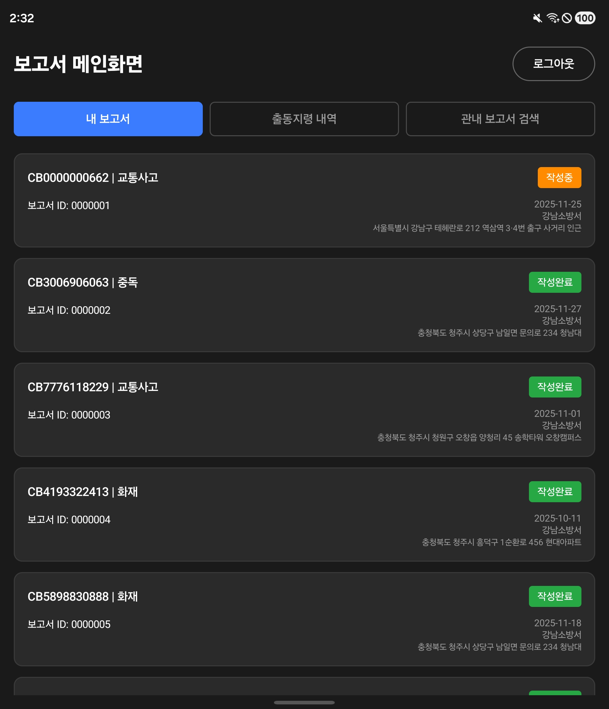
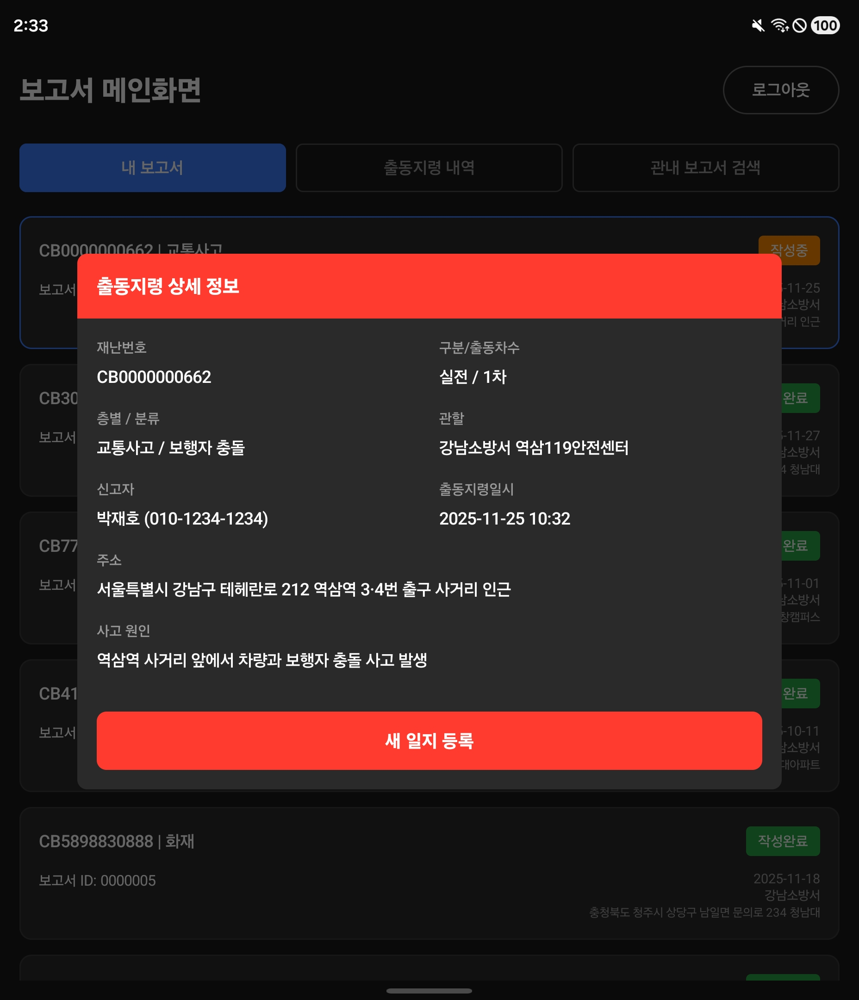
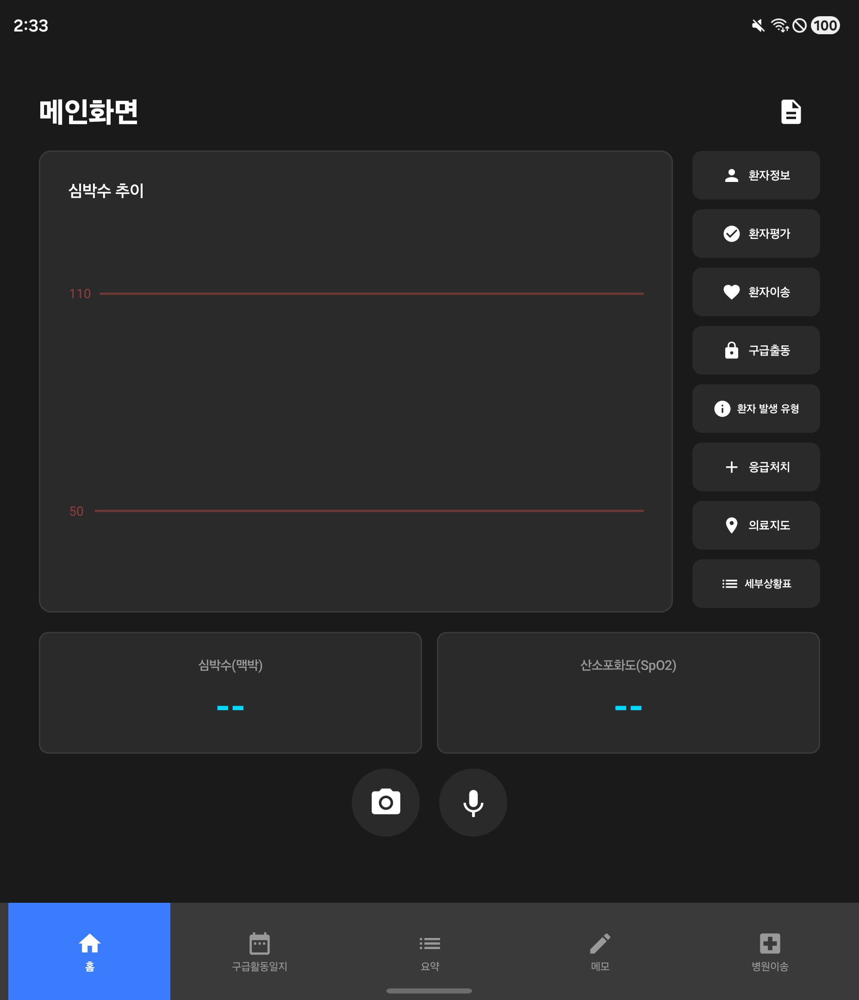
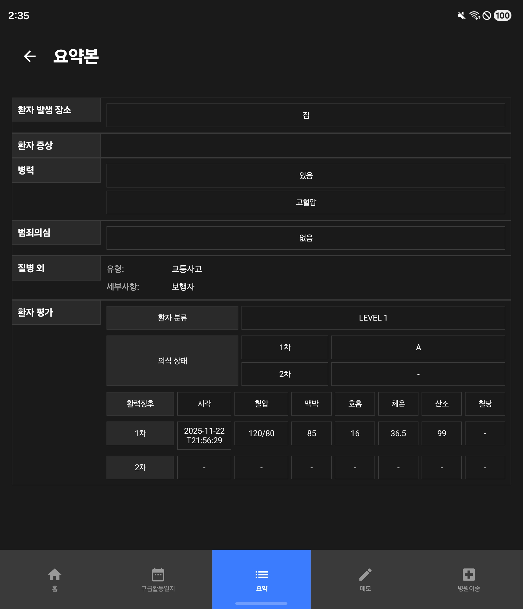
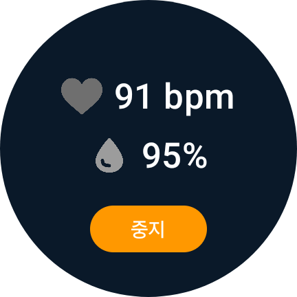
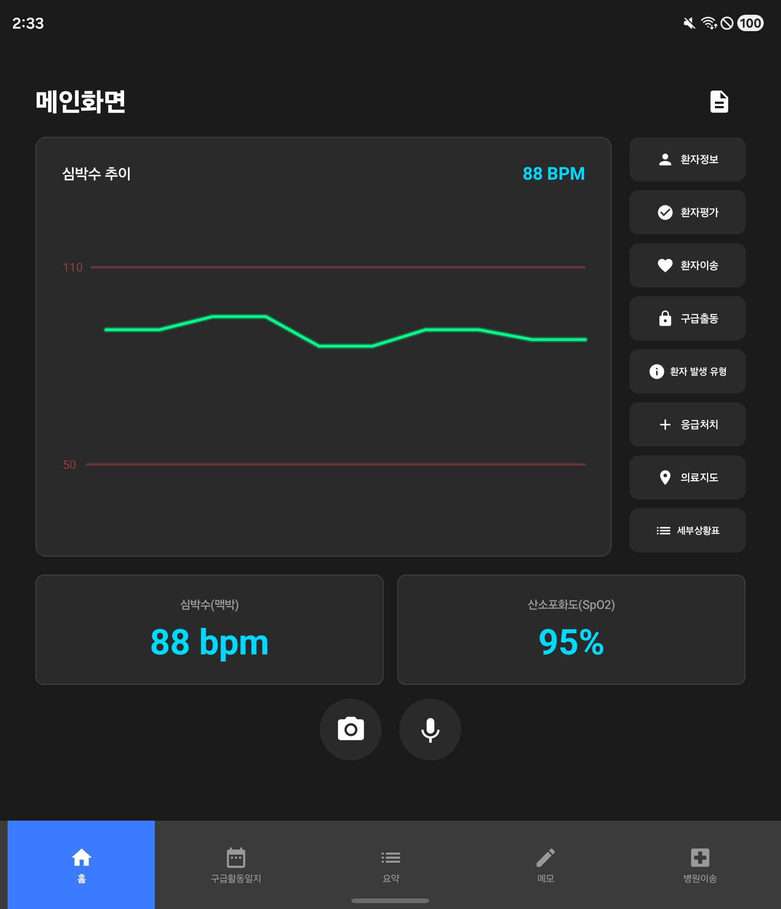
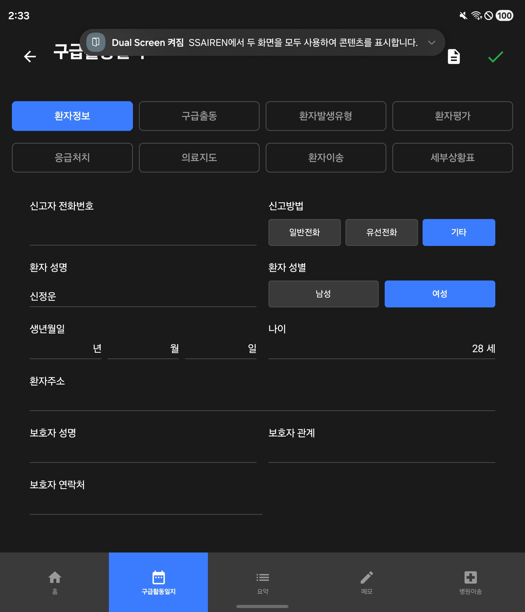
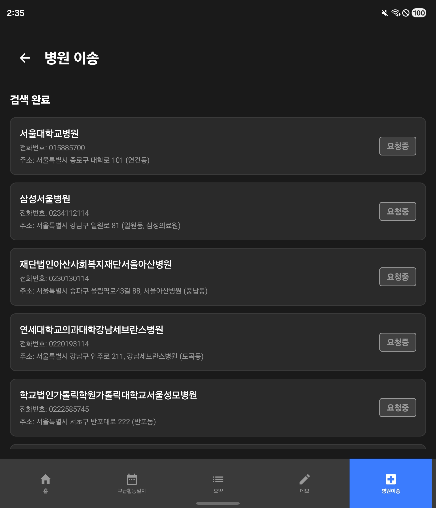
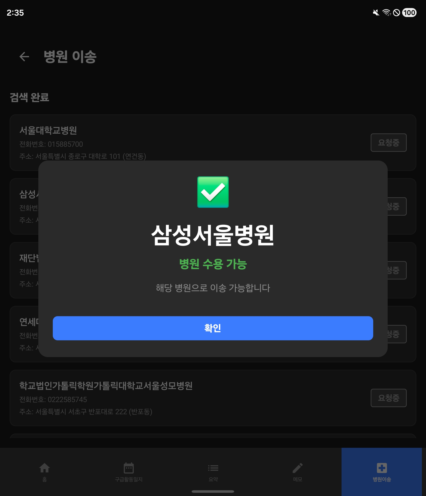

# SSAIREN

**AI로 문진부터 기록까지, 구급대원의 손을 자유롭게 하는 스마트 EMS(Emergency Medical System)**

## 목차

- [프로젝트 소개](#프로젝트-소개)
- [핵심 특징](#핵심-특징)
- [주요 화면](#주요-화면)
- [주요 기능](#주요-기능)
- [기술 스택](#기술-스택)
- [시스템 아키텍처](#시스템-아키텍처)
- [프로젝트 구조](#프로젝트-구조)
- [개발 가이드](#개발-가이드)
- [팀원 소개](#팀원-소개)
- [관련 문서](#관련-문서)

## 프로젝트 소개

## **1. 개요**

SSAIREN(스마트 구급활동 보조 서비스)은 **응급 현장의 모든 업무 흐름을 단일 디바이스에서 자동화·지능화**하는 AI 기반 구급활동 어시스턴트 플랫폼이다.
음성 기반 문진 자동 기입, 웨어러블 연동 바이탈 모니터링, 병원 자동 선정, 현장 영상 기록, 온프레미스 AI 추론을 하나의 체계로 통합하여 **구급대원의 문서·판단 업무 부담을 최소화하고, 환자 이송 의사결정을 가속화**한다.

본 서비스는 Faster-Whisper 기반 실시간 STT, Qwen2.5 기반 도메인 LLM, 병원 수용도 API, 오프라인 캐싱, Firebase 지속 알림 등 인프라 전반을 아우르는 구조로 설계되어 있어 **실제 운영 환경(구급차·현장·응급실)에 최적화된 실무형 응급지원 시스템**을 제공한다.

---

## **2. 배경 및 목적**

응급 현장은 **분 단위 의사결정**과 동시에 **복잡한 기록·판단 업무**가 요구되는 환경이다.
그러나 기존 시스템은 다음과 같은 실무적 문제가 존재한다:

* 문진 내용을 기록하기 위해 **핸드폰 · 바디캠 · 태블릿 · 무전기** 등 여러 장비를 동시에 운용해야 함
* 의료/구급 전문용어가 많은 현장 대화를 **정확히 기록하기 어렵고 누락되기 쉬움**
* 혼잡도·거리·환자 상태를 **실시간 반영해 병원을 자동으로 선정하는 시스템 부재**
* 네트워크 장애 시 **문서 입력·전송이 중단되는 구조**
* 병원에서 요구하는 필수 인계 항목이 현장 기록과 일치하지 않아 **정보 재기입 및 지연 발생**

SSAIREN의 목적은 다음과 같다:

1. **현장 문진 기록 자동화**
   – 로컬 STT로 대화를 전사하고, LLM이 CC/Hx/증상/바이탈 항목을 자동 정제해 구급활동일지 초안 생성

2. **생체 정보 기반 환자 상태 추적**
   – Galaxy Watch의 심박수·SpO₂를 실시간 수집하여 이상 징후를 자동 감지

3. **최적 병원 자동 선정 및 수용 여부 실시간 확인**
   – 거리·혼잡도·환자 상태를 알고리즘으로 계산
   – 다중 병원 병렬 요청 → 최초 응답 병원을 자동 확정

4. **단일 디바이스 운영으로 현장 효율 극대화**
   – 바디캠 촬영, 일지 작성, 지령 수신, STT/LLM 분석을 한 기기로 처리

5. **환자 정보 보호를 위한 온프레미스 AI 운영**
   – Whisper·Qwen 모델을 서버 내부에서만 추론하여 민감정보 외부 유출 방지

6. **오프라인 상황 대응 강화**
   – 통신 장애 시 로컬 저장 → 복구 후 자동 동기화로 누락 제로화

7. **구급차 내원 환자 기반 데이터 분석 시스템 구축**
   – 시간대/유형/환자 특성 데이터 분석으로 병원 연구·운영 개선에 기여

---

## **3. 프로젝트 비전**

SSAIREN은 단순한 STT·일지 보조 도구가 아니라,
**응급 현장의 전체 Data Flow를 자동화하고, 환자-구급대원-병원까지 이어지는 실시간 데이터 생태계를 구축하는 것을 목표**로 한다.

### **(1) 실시간 · 자동화된 구급활동 AI 플랫폼**

* 음성 문진 → STT → LLM 정제 → 일지 자동 생성
* 환자 상태 변화 → 웨어러블 → 경고/기록 자동 반영
* 응급실 혼잡도 → 알고리즘 → 병원 자동 확정

### **(2) 온프레미스 기반 의료 특화 AI 운영**

* 외부 API 의존 제로
* 의료 데이터가 내부에서만 처리되는 **보안·컴플라이언스 준수형 구조**
* LoRA + GGUF 양자화를 통한 **AI 경량화·고속화 추론**

### **(3) 구급–병원–행정까지 연결되는 데이터 플랫폼**

* 구급차 내원 환자 통계
* 지역·시간·재난 유형별 패턴 분석
* 응급실 자원 배분과 연구 의사결정을 지원하는 “데이터 백본”

### **(4) 현장 퍼포먼스와 사용자 경험 최적화**

* 단일 디바이스 운영
* 네트워크 장애 무중단 기록
* 즉시 사용 가능한 UI/UX 제공

### **(5) 확장 가능한 국가 단위 응급 Response 인프라**

향후에는 다음과 같은 확장을 목표로 두고 있다:

* 도시 단위 구급 데이터 통합
* 전국 응급센터와 연동되는 실시간 병원 수용 맵
* 음성·영상·웨어러블 기반의 종합 현장 Record Pipeline
* LLM 기반 자동 인계서 작성 및 병원 EHR 연동

---
## 핵심 특징

## **1. 음성 기반 구급활동일지 자동화**

* Faster-Whisper Medium 기반 로컬 STT로 현장 대화를 실시간 전사
* VAD 기반 잡음 제거 및 화자 분리
* Qwen2.5 LoRA 모델이 CC/Hx/증상/바이탈 등 필수 항목을 JSON으로 자동 추출
* 구급활동일지 초안 생성 → 수정까지 자동 지원
* 의료 전문 용어·구어체 오타를 교정하는 정제 파이프라인 내장

## **2. 웨어러블 연동 생체 신호 실시간 모니터링**

* Galaxy Watch로 측정되는 심박수·SpO₂를 실시간 수집
* 비정상 패턴(지속 고위험 수치) 발생 시 즉시 경고
* 수치와 타임스탬프가 활동일지·인계 데이터에 자동 반영

## **3. 알고리즘 기반 응급실 자동 선정**

* 환자 상태(중증도), 거리, 소요 시간, 병원 혼잡도 기반 실시간 계산
* 다중 병원에 병렬 요청 → 최초 응답 병원 자동 확정
* ‘내 손안의 응급실’ API로 병상·혼잡도 정보를 실시간 업데이트

## **4. 단일 디바이스 통합 운영 환경**

* 바디캠 촬영, 일지 작성, 지령 수신, STT/LLM 분석을 **한 기기에서 처리**
* Galaxy Fold를 활용한 현장 최적화 UI
* 장비 분산으로 발생하던 입력 지연·업무 누락을 최소화

## **5. 온프레미스 AI 기반 보안 강화**

* Whisper·Qwen 모델을 자체 서버에서 구동하는 완전 온프레미스 구조
* 환자 정보 외부 유출을 원천 차단
* GGUF 양자화 및 CPU 기반 추론으로 운영 비용 최소화

## **6. 오프라인 대응 및 자동 동기화**

* 네트워크 불안정/중단 구간에서 로컬 캐시로 데이터 저장
* 연결 복구 시 자동 전송
* 현장에서의 데이터 누락 및 인계 지연 방지

## **7. 현장 발화·패턴 기반 실제형 AI**

* 구급대원/환자 실제 대화 로그 기반 질의·응답 패턴 학습
* 근육통·두통·어지러움 등 증상별 발화 시나리오 사전 구성
* 의료 용어·환자 표현·오타 사례를 기반으로 한 정제 모델 구축

## **8. 구급차 내원 환자 기반 데이터 분석 시스템**

* 시간대·재난 유형·환자 특성에 대한 통계 페이지 제공
* 병원의 운영 효율화(병상 관리·환자 분포 분석) 지원
* 의료 데이터 기반의 연구·정책 의사결정에 활용 가능

## **9. 안정적인 알림 인프라(Firebase Topic 기반)**

* 푸시 메시지를 토픽별로 분리해 병원·구급대원별 정밀 알림 제공
* 연결 품질이 불안정한 환경에서도 안정적 메시지 전달

## **10. 운영 효율을 위한 모델 관리 체계**

* 환경변수 기반 모델 관리(경로·컨텍스트 길이·스레드 조정)
* 1.5B LoRA 모델로 실시간 처리 가능
* Whisper/Qwen 추론 병렬화로 현장 처리 속도 향상

---

## 주요 화면

## APP
### 보고서 메인 페이지

### 출동 지령 상세 정보 모달

### 지령 메인 화면 

### 지령 요약 페이지

### 워치 어플리캐이션 바이탈 체크 화면

### 워치 연동 후 페이지

### 구급활동 일지 환자정보

### 이송 가능 병원 요청 페이지

### 수용 가능 병원 모달

## Web

### 대시보드

### 로그인

### 시간 분석 상세 보기

### 시간 분석 페이지

### 응급 환자 모달 접음

### 응급 환자 모달 핌

### 재난 유형

### 재난유형상세보기

### 환자 통계

### 환자 통계 상세보기

## 주요 기능

## **1. 음성 기반 문진 자동 기입**

* 구급대원–환자 대화를 실시간 STT로 전사
* CC(주호소), Hx(병력), 증상(통증 위치·강도·발생 시점 등)을 자동 추출하여 기록
* 문진 항목 누락 시 LLM이 추가 질문을 제안
* 정제된 문장은 구급활동일지 초안에 자동 반영

## **2. 자동 구급활동일지 생성 및 편집 지원**

* STT 전사문을 기반으로 일지 구조(JSON Schema)에 맞게 자동 구조화
* 증상, 바이탈, 병력, 이송 결정 등 일지 핵심 항목 자동 채움
* 구급대원이 문서 일부만 수정하면 전체 포맷이 자동 맞춰짐
* 오타/비문/구어체 표현을 자동 교정

## **3. 갤럭시 워치 기반 실시간 바이탈 모니터링**

* 심박수·산소포화도(SpO₂)를 1–5초 단위로 수집
* 위험 임계치 도달 시 즉시 알림 표시
* 바이탈 변화 기록이 일지·인계 정보에 자동 저장
* 이송 중 지속 모니터링 UI 제공(그래프 기반)

## **4. 단일 디바이스 통합 운영**

* Galaxy Fold 1대에서

   * 바디캠(영상 기록)
   * STT 문진
   * 구급활동일지 작성
   * 병원 지령 수신
     를 모두 수행
* 디바이스 간 전환 부담 없이 현장 중심 UI 제공

## **5. 응급실 자동 선정 알고리즘**

* 환자 중증도, 이동 거리, 예상 소요 시간, 병원 혼잡도 기반 점수화
* 병원 여러 곳에 자동 수용 요청 → 가장 빠른 응답 병원 자동 확정
* 수용 여부 결과가 앱에 실시간 표시
* ‘내 손안의 응급실’ API 기반 병상 현황 수집

## **6. 병원 시스템 연동 및 자동 알림**

* 병원 측에 환자 도착 시간·증상·바이탈을 자동 전송
* Firebase Topic 기반 푸시로 병원/대원별 커스텀 알림 제공
* 병원 수용/거절 응답이 실시간 반영

## **7. 오프라인 캐시 및 자동 동기화**

* 현장에서 네트워크가 끊겨도 모든 기록이 로컬에 안전 저장
* 통신 복구 즉시 자동 업로드
* 신고·기록·이송 정보 누락 방지

## **8. 지속 업데이트되는 발화 시나리오 라이브러리**

* 실제 환자 표현(찌릿찌릿, 욱씬욱씬 등) 기반 질의·응답 패턴 사용
* 증상별(두통·근육통·어지럼증 등) 대표 질문/답변 자동 보완
* 교육훈련 시나리오로도 활용 가능

## **9. 데이터 기반 병원 통계/분석 페이지**

* 구급차 내원 환자의

   * 내원 시간
   * 재난 유형
   * 환자 연령/성별
   * 주요 증상
     등을 시각화해 제공
* 병원 운영 개선 및 연구 데이터를 구축할 수 있는 기반 제공
* 특정 증상/계절/시간대 패턴 분석 가능

## **10. 온프레미스 AI 파이프라인 운영**

* Faster-Whisper Medium 로컬 추론으로 빠르고 안정적인 STT
* Qwen2.5 Instruct + LoRA 파인튜닝으로 의료 특화 정보 추출
* GGUF 양자화 모델로 CPU 기반에서도 고속 추론
* 환자 정보 외부 전송 없이 보안·컴플라이언스 충족

---
## 기술 스택

### Frontend

### Backend

**주요 의존성**
- **Spring Data JPA**: ORM 및 데이터베이스 추상화
- **Spring Security + OAuth2**: 인증 및 소셜 로그인
- **Spring Kafka**: 이벤트 스트리밍
- **SpringDoc OpenAPI (Swagger)**: API 문서 자동 생성
- **MinIO SDK**: 객체 스토리지 클라이언트
- **Lombok**: 보일러플레이트 코드 감소

### AI/ML

### Database & Storage

**데이터베이스 역할**
- **PostgreSQL**: 주요 관계형 데이터 (사용자, 검사 결과, 일기, AI 대화 로그)
- **Redis**: Refresh Token 저장, 온보딩 페이지 한마디 API 1시간 캐시, 게임 횟수 캐시
- **MinIO**: 사용자 업로드 파일 및 이미지 저장

### Data Streaming

### DevOps & Infrastructure

**인프라 구성**
- **Docker Compose**: 컨테이너 오케스트레이션
- **Jenkins**: CI/CD 파이프라인
- **Nginx**: 리버스 프록시 및 로드 밸런싱
- **Let's Encrypt**: SSL/TLS 인증서
- **Grafana + Prometheus**: 모니터링 및 메트릭
- **AWS EC2 (2 Instances)**: 서버 호스팅

---

## 시스템 아키텍쳐

## 팀원 소개

| 이름                                      | 역할                     |
|-----------------------------------------|------------------------|
| [최상인](https://github.com/sangin302)      | **AI/ML Developer**    |
| [신정운](https://github.com/SHIN-JEONG-UN) | **Frontend Developer** | 
| [박재호](https://github.com/Pong0882)      | **DevOps Developer**    | 
| [함영은](https://github.com/yeongenn)      | **Frontend Developer**  |
| [김민정](https://github.com/minjeong17)    | **Backend Developer**  | 
| [박정현](https://github.com/hinoky4693)    | **Backend Developer**   | 
